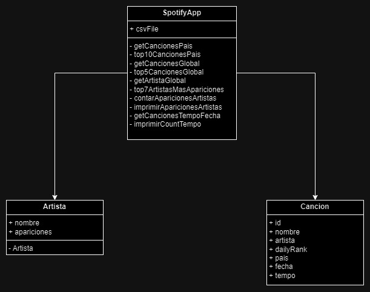

# obligatorio-p2-2024 -- Spotify en Uruguay --

Este programa esta diseñado para continuar con la construccion de la aplicacion Spotify, luego de la exitosa prueba plioto en Uruguay.
En la misma se logra obtener estadisticas sobre la escucha en un pais o globalmente, incluyendo tambien un sistema recomendador.

# Contenido:
1. Requicitos y pasos para el uso del programa
2. Estructura
3. UML
4. Breve descripcion de las funciones
5. Medicion de eficiencia.
6. Usuarios, contacto y agradecimientos

## 1. Requicitos y pasos para el uso del programa
## Requisitos:
para ejecutar dicho programa, es nesesario tener:
1. Java JDK 17 o superior (se recomienda la version 21 o 22)
2. Intellij IDEA
3. Acceso al repositorio de github

## Pasos para descargar el programa:
Instrucciones para descargar el programa mediante la consola:
1. Ingrese a Github, y luego al respectivo repositorio.
2. Ve a donde dice "code", precione HTTPS, y copie el enlace que aparece debajo.
3. Abra Intellij IDEA.
4. Abra la consola para clonar el repositorio.
5. Con la consola abierta escriba ¨git clone¨ y copie la URL del paso 2.
6. Después de estos pasos, la copia del proyecto se encontrará en su computadora, lista para comenzar a ejecutarlo.

Si de esa manera no lo logra, recomendamos instalarse Github desktop y seguir los siguientes pasos:
1. Abrimos el GitHub Desktop
2. Apretamos donde dice: Open the repository in your external editor
3. seleccionas tu editor de preferencia (Recomendamos el uso de Intellij IDEA)
4. Te aparecera un boton que dice: Open in intelliji y te abrira el proyecto en una pantalla de intelliji

## Recomendacion para el uso
Para asegurarse de que el programa funcione sin pequeños percanses,
recomendamos abrir los archivos para que carguen del todo.
Para luego poder continuar con la ejecucion:
1. Insertar el arcivo .csv debajo del archivo "pom.xml" como aparece en el esquema debajo. Asegurarse que en "SotifyApp" quede bien ingresado el nombre del archivo.
2. Vaya a al archivo que dice "Main" (ver esquema abajo de donde se encuentra el archivo).
3. Luego dentro de esta, precione el simbolito de reproduccion (play) que aparece  en la esquina superior derecha.
4. Intellij abrira una terminal.
5. En dicha terminal aparecerar opciones e informacion para completar.
6. Responda en la misma terminal, y el programa continuara corriendo automaticamenta.

## 2. Estructura del proyecto
El programa se encuentra en una carpeta llamada Obligatorio-P2-2024.

obligatorioTest

├── .idea

├── obligatorioTest

        ├── .idea
        ├── Readme
        │     └─ Readme.md
        │            ├─ recursos
        │            │      └─ UML.jpeg
        │            └─ Readme.md
        │
        ├── src
        │    
        │    └─ main
        │        └─ java
        │            └─ uy.edu.um
        │                ├── entities
        │                │           ├── Artista
        │                │           ├── Cancion
        │                │           └── SpotifyApp
        │                ├── tads
        │                │     ├── heap
        │                │     │     └── MyHeap
        │                │     ├── list
        │                │     │   ├── MyLinkedListImpl
        │                │     │   ├── MyList
        │                │     │   └── Node
        │                │     ├── queue
        │                │     │   ├── EmptyQueueException
        │                │     │   ├── MyQueue
        │                │     │   └── MyQueueImpl
        │                │     ├── stack
        │                │     │   ├── EmptyStackException
        │                │     │   ├── MyStack
        │                │     │   └── MyStackImpl
        │                │     └── tree
        │                │         ├── BinarySearchTree
        │                │         ├── BinarySearchTreeImpl
        │                │         ├── BinaryTree
        │                │         ├── BinaryTreeImpl
        │                │         └── TreeNode
        │                └── Main
        │
        │
        │
        ├── target
        ├── .gitignore
        ├── pom.xml
        ├── spotify_data.csv
├── External Libraries

├──Scratches and consoles

El lugar donde se ejecutara todo, sera en el Main.

## 3. Modelo UML

----

Atributos con su tipo y funciones

#### SpotifyApp
- String csvFile
+ getCancionesPais()
+ top10CancionesPais()
+ getCancionesGlobal()
+ top5cancionesGlobal()
+ getArtistasGlobal()
+ top7ArtistasMasApariciones()
+ contarAparicionesArtista()
+ imprimirAparicionesArtista()
+ getCancionesTempoFecha()
+ imprimirCountTempo()
 

#### Clase Artista
- String nombre;
- int apariciones
+ Artista()

#### Clase Cancion
- String id;
- String nombre;
- String artista;
- String dailyranking;
- String ciudad;
- String fecha;
- double tempo;

## 4. Breve descripcion de las funciones
El programa principal (main) tiene implementada una funcion para importar datos desde un archivo CSV de 
manera eficiente. En lugar de cargar todos los datos de una vez, lo que podría consumir mucha memoria y 
tiempo, cada función se encarga de traer solo la información necesaria cuando es llamada. 
Esto optimiza el uso de recursos y mejora el rendimiento del programa. 

### Funciones:

#### getCancionesPais(String date, String country)
Al ejecutar esta función, utilizamos la técnica de Hash map, tomando como clave el string id de la cancion 
y como elemento la instancia del objeto "Cancion". De esta manera, nos aseguramos de traer solo 
las canciones del país correspondiente. Y finalmente cuando termina de recorrer todas las lineas de el archivo
obtendremos un Hash map, con todas las canciones del pais solicitado.

#### top10CancionesPais(String date, String country)
Para esta llamamos a la función anterior para construir el heap con el pais que se pase por constructor.
Para trabajar el Heap Definimos un comparador basado en el "daily rank".
A continuación, creamos el nuevo heap y utilizamos un bucle for para comparar y encontrar los valores más 
altos. Este heap se convierte en una lista de la cual extraemos los 10 valores más grandes.

#### getCancionesGlobal(String date)
Al ejecutar esta función, utilizamos la técnica de Hash map, tomando como clave el string id y 
como elemento la instancia del objeto "Cancion" y a ese Hah el llamamos cancionesMap. 
Previo a ese Hash map, creamos otro llamado songCountMap el cual utiliza el id de la canción y tiene un contador "Integer counter"
el cual cada vez que una canción aparece en cancionesMap, busca en songCountMap el id de la cancion y
incrementamos el contador correspondiente en 1. 
Esto nos permite llevar un registro de la frecuencia con la que se repiten las canciones.

Luego de haber terminar de recorrer el archivo, el songCountMap se ordena con el metodo de "sorted" comparando
los valores del counter de las canciones, se limita el tamaño de la lista a 5, asi seleccionando las 5 primeras canciones mas repetidas.

#### top5CancionesGlobal(String date)
Obtiene la lista de la funcion getCancionesGlobal(), y imprime la lista obtenida al final de la misma, imprimiendo el nombre de la cancion.

#### getArtistasGlobal(String fechaInicio, String fechaFin)
Creamos un Hash map donde la clave es el nombre del artista y el valor es la instancia del objeto Artista. 
Para un rango de fechas especificado, obtenemos los artistas los cuales han tenido apariciones. 
Cada vez que un artista aparece en ese rango de fechas, se incrementa su contador de apariciones en 1. 
Al finalizar, devolvemos todos los artistas con el número total de apariciones registradas en el rango de fecha seleccionado.

#### top7ArtistasMasApariciones(String fechaInicio, String fechaFin)
Obtenemos la lista de artistas utilizando la función getArtistaGlobal(). 
Trabajamos esta lista con un comparador basado en la cantidad de apariciones del mismo en ese periodo de tiempo
y construimos un heap con estos artistas.
Recorremos este heap utilizando un bucle for, comparando las a pariciones de los artistas y guardándolos 
en una lista ordenada de manera decendente. Finalmente, limitamos esta lista a los 7 artistas con más apariciones en esas fechas 
y los imprimimos.

#### contarAparicionesArtista(String fecha, String artistaBuscado)
Pasamos una fecha y un artista a la función. 
Iniciamos un contador en 0 para registrar las apariciones del artista en esa fecha.
Por cada línea que coincide con el artista y la fecha especificada, incrementamos el contador en 1.

#### imprimirAparicionesArtista(String fecha, String artista)
Llama a la funcion anterior contarAparicionesArtista(), y con la misma imprime
el nombre del artista, la canidad de veces que aparecio y la fecha.

#### getCancionesTempoFecha(String fechaInicio, String fechaFin, double minTempo, double maxTempo)
Pasamos una fecha de inicio, una fecha de fin, un minTempo y un maxTempo a la función, y generamos un contador inicializado en 0. 
La función revisa cada registro dentro de este rango de fechas y comprueba si la fecha y el tempo
con los rangos especificados por la consola. Si coinciden, incrementa el contador en 1.

#### imprimirCountTempo(String fechaInicio, String fechaFin, Double minTempo, Double maxTempo)
Llama a la funcion anterior getCancionesTempoFecha(), y luego de pasarle los atributos a la misma
y ejecutar el procedimiento, esta nos imprimira el numero de canciones que tienen un tempo entre minTempo y maxTempo
y que se encuentran entre fechaInicio y fechaFin con la cantidad de canciones que hay ( el counter).

## 5. Medicion de la eficiencia
- getCancionesPais - O(n)
- getCancionesGlobal - O(n)
- getArtistasGlobal - O(n)
- contarAparicionesArtista - O(n)
- imprimirAparicionesArtista - O(n)
- getCancionesTempoFecha - O(n)
- imprimirCountTempo - O(n)
- top5CancionesGlobal - O(n)
- top10CancionesPais - O(n log n)
- top7ArtistasMasApariciones - O(n log n)

## 6. Usuarios, contacto y agradecimientos

### Usuarios
- Agustina Lauz (agustina-lauz)
- Federica Aguirre (Estudios y fpaguirre)
- Matias Senatore (matiassenatore)
- Felipe Santini (pipesantini)

### Contacto
alauz1@correo.um.edu.uy  
fpaguirre@correo.um.edu.uy  
msenatore@correo.um.edu.uy  
fsantini@correo.um.edu.uy

### Agradecimiento
Agradecemos al equipo por el desarrollo del proyecto, ya que fue un desafio. Tambien agradecemos al profesor quien nos impulso a ir a mas.

